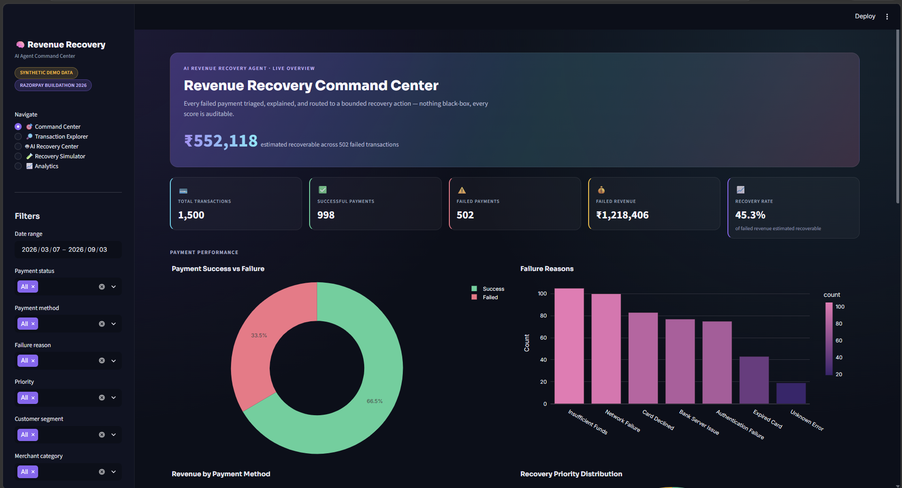
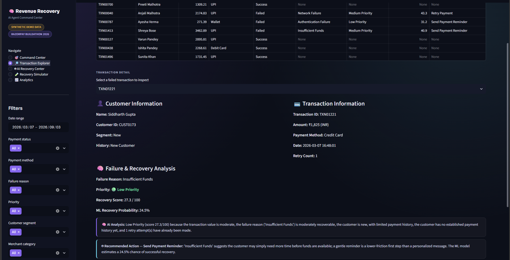
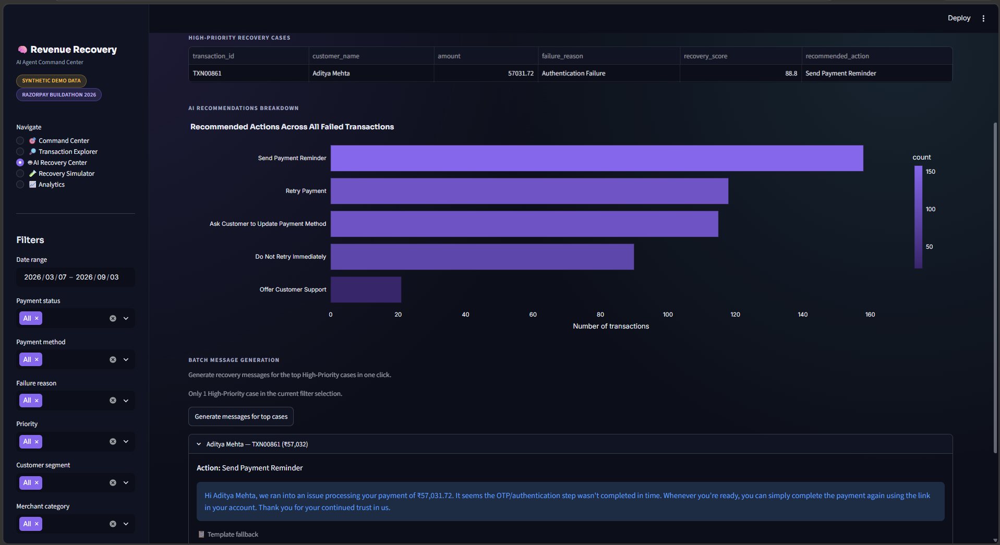
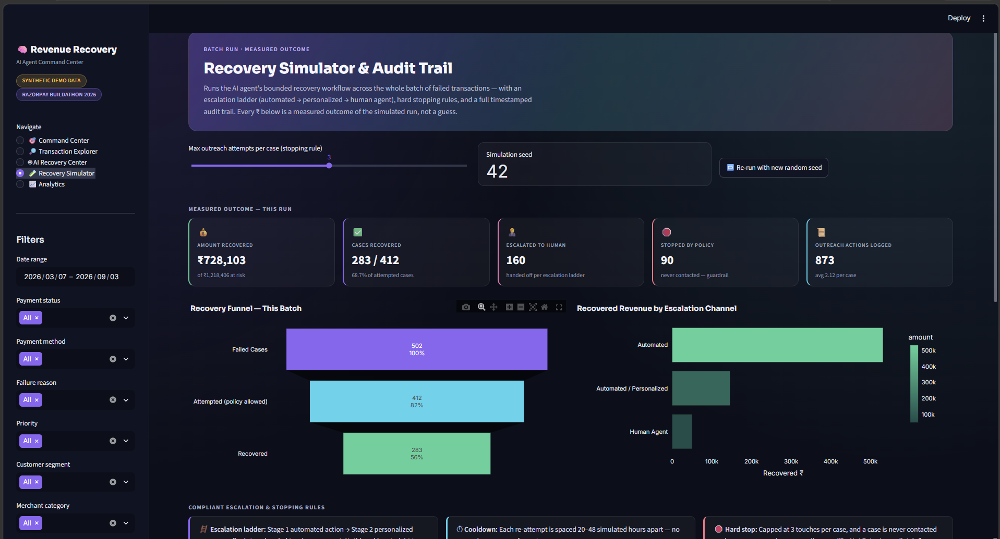
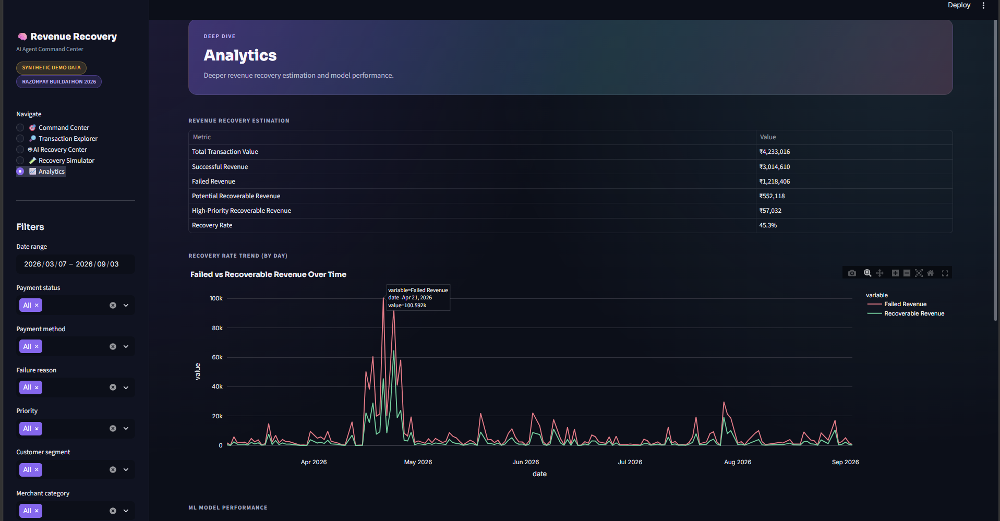

<div align="center">

# 🧠 AI Revenue Recovery Agent

### Find the revenue that's slipping away. Win it back. Prove it.

*Built for the Razorpay AI Buildathon 2026 — Track 03: AI Revenue Recovery*

[](https://www.python.org/)
[](https://streamlit.io/)
[](https://scikit-learn.org/)
[](https://plotly.com/)
[](#-disclaimer)

</div>

---

> ⚠️ **Disclaimer:** All transaction and customer data in this project is **100% synthetically generated** for demonstration purposes only. No real payment or customer data is used, stored, or transmitted anywhere. This project is **not officially affiliated with or connected to Razorpay** — it does not use the real Razorpay API and does not process real payments.

---

## 💡 The Idea

Failed payments don't all deserve the same response. A network blip, an expired card, and a customer who genuinely doesn't have the funds are three completely different problems — but most businesses treat them identically: ignore them, or blast every customer with the same generic "please retry" message.

**AI Revenue Recovery Agent** treats recovery as a real pipeline:

```
Failed Payment
      │
      ▼
AI scoring (why did it fail, how recoverable is it?)
      │
      ▼
ML model (what's the actual probability a retry works?)
      │
      ▼
Decision Agent (one clear, explainable recovery action)
      │
      ▼
Personalized AI message (LLM-generated, safe fallback)
      │
      ▼
Recovery Simulator (runs the whole batch, proves ₹ recovered)
```

Every step is explainable — there's no unexplained black-box decision anywhere in the pipeline, and the final page doesn't just *estimate* recovered revenue, it **simulates the actual recovery workflow and measures the result**.

---

## 📸 Screenshots

### 🎯 Command Center
Live overview of every transaction — total volume, failed revenue, and the headline **estimated recoverable revenue** number, backed by real charts (failure reasons, payment methods, priority mix, merchant category breakdown).



### 🔎 Transaction Explorer
Drill into any single failed transaction and see the full AI reasoning: recovery score, ML-predicted recovery probability, the recommended action, and a plain-English explanation for both — plus a one-click AI-generated recovery message.



### 🤖 AI Recovery Center
The daily-driver view for a recovery team — every High-Priority case ranked by score, a breakdown of recommended actions across the whole batch, and one-click batch message generation for the top cases.



### 🧪 Recovery Simulator — the centerpiece
Actually **runs** the bounded recovery workflow across every failed transaction — escalation ladder (automated → personalized → human agent), hard stopping rules, a recovery funnel, and a full timestamped, exportable **audit trail**. This is where "estimated recoverable" becomes "measured recovered."



### 📈 Analytics
Revenue recovery estimation table, a 6-month failed-vs-recoverable revenue trend (including a simulated festive-season spike), and the ML model's feature importances.



---

## ✨ Key Features

- 📊 **Interactive Streamlit dashboard** — 5 pages, dark fintech theme, metrics, charts, filters, and drill-downs
- 🧠 **Rule-based Recovery Priority Score** (0–100) with a fully transparent, documented formula
- 🤖 **Explainable AI Decision Agent** — recommends one of 6 recovery actions, always with a plain-language reason
- 🔬 **Scikit-learn ML model** — RandomForest, predicts the probability a failed transaction recovers if retried
- ✍️ **LLM-powered personalized messages** — unique per customer, three interchangeable providers (Groq, Gemini, OpenAI), with an automatic template fallback if no key is set
- 🧪 **Recovery Simulator** — actually runs a bounded, compliant recovery workflow across the whole batch: escalation ladder, stopping rules, cooldowns, and a full audit trail — with **measured** ₹ recovered, not a guess
- 💰 **Revenue recovery estimation** — total, successful, failed, and potential recoverable revenue, plus recovery rate
- 🌆 **Multi-vertical synthetic dataset** — 1,500 transactions across e-commerce, food delivery, ride-hailing, SaaS, and travel, over a 6-month window with a simulated festive-season spike
- 🔐 **No hard-coded secrets** — API keys loaded from `.env`, safe fallback mode built in

---

## 🏗️ Architecture

```
┌──────────────────┐     ┌──────────────────────┐     ┌────────────────────┐
│  data/            │────▶│  agents/analyzer.py   │────▶│  agents/decision_   │
│  payments.csv     │     │  (priority scoring)   │     │  agent.py (action)  │
└──────────────────┘     └──────────────────────┘     └─────────┬──────────┘
        │                          ▲                             │
        │                          │                             ▼
        │               ┌──────────┴──────────┐        ┌────────────────────┐
        │               │ models/              │        │ agents/message_    │
        │               │ recovery_model.py     │        │ generator.py (LLM) │
        │               │ (ML probability)      │        └─────────┬──────────┘
        │               └───────────────────────┘                  │
        │                                                           ▼
        │                                              ┌────────────────────────┐
        └─────────────────────────────────────────────▶│ agents/recovery_        │
                                                         │ simulator.py (batch run,│
                                                         │ escalation, audit trail)│
                                                         └───────────┬────────────┘
                                                                     ▼
┌───────────────────────────────────────────────────────────────────────────────┐
│                              app.py (Streamlit UI)                              │
│  Command Center │ Transaction Explorer │ AI Recovery Center │ Recovery         │
│  Simulator │ Analytics                                                         │
└───────────────────────────────────────────────────────────────────────────────┘
```

---

## 🛠️ Technology Stack

| Layer | Tool |
|---|---|
| Dashboard / frontend | **Streamlit** |
| Data processing | **Pandas**, **NumPy** |
| Machine learning | **Scikit-learn** (RandomForestClassifier) |
| Charts | **Plotly** |
| AI messaging | **Groq**, **Google Gemini**, or **OpenAI** (any one, free-tier friendly) |
| Config / secrets | **python-dotenv** |
| Model persistence | **joblib** |
| Language | **Python 3.11+** |

---

## 📁 Project Structure

```
AI-Revenue-Recovery-Agent-main/
│
├── app.py                        # Streamlit dashboard (entry point)
├── requirements.txt
├── README.md
├── .gitignore
├── .env.example
├── .env                          # your local keys — gitignored, never pushed
│
├── data/
│   ├── generate_data.py          # synthetic dataset generator (v2 — multi-vertical)
│   └── payments.csv              # generated demo dataset (1,500 transactions)
│
├── agents/
│   ├── analyzer.py               # recovery priority scoring + explanations
│   ├── decision_agent.py         # explainable action recommendation
│   ├── message_generator.py      # LLM (Groq/Gemini/OpenAI) + template fallback
│   └── recovery_simulator.py     # batch recovery run, escalation, audit trail
│
├── models/
│   ├── recovery_model.py         # RecoveryModel class (train/predict/save/load)
│   ├── train_model.py            # training script
│   └── recovery_model.pkl        # saved trained model (generated)
│
├── utils/
│   └── data_processor.py         # loading, metrics, filters
│
├── .streamlit/
│   └── config.toml               # dark theme configuration
│
└── assets/                       # dashboard screenshots (this README)
```

---

## 🧠 How the AI Agent Works

The "AI Agent" here is deliberately **several cooperating pieces**, not one opaque model — this keeps the whole system explainable end-to-end:

1. **Rule-based Recovery Priority Score** (`agents/analyzer.py`) — a transparent weighted formula scoring *how much a transaction is worth recovering*.
2. **ML Recovery Likelihood Model** (`models/recovery_model.py`) — a RandomForestClassifier estimating *how likely a retry is to succeed*, learned from historical outcomes.
3. **Decision Agent** (`agents/decision_agent.py`) — combines priority, failure reason, retry count, and ML probability to pick one of six recovery actions, with a one-sentence justification.
4. **Message Generator** (`agents/message_generator.py`) — turns the decision into a personalized customer message via an LLM, or a varied template if no key is set.
5. **Recovery Simulator** (`agents/recovery_simulator.py`) — runs the full workflow across a batch of failed transactions with an escalation ladder and hard stopping rules, and logs every action to an audit trail.

Nothing in this pipeline is a black box — every score and every recommendation comes with a human-readable "why."

---

## 📐 How Recovery Priority Is Calculated

`agents/analyzer.py` computes a **Recovery Priority Score (0–100)** as a weighted sum of five factors:

| Factor | Weight | Logic |
|---|---|---|
| Transaction amount | 40% | Normalized against the largest transaction in the dataset — bigger amounts matter more |
| Failure reason recoverability | 25% | e.g. Network Failure (0.90) is much easier to recover than Unknown Error (0.25) |
| Customer segment | 15% | Premium (1.0) > Regular (0.65) > New (0.35) |
| Customer history | 10% | Loyal Customer (1.0) > Regular Customer (0.75) > Occasional Buyer (0.45) > New Customer (0.2) |
| Retry count | 10% | 0 retries = 1.0 (fresh, worth trying), 3+ retries = 0.2 (diminishing returns / fatigue) |

The final score buckets into:
- **High Priority** ≥ 65
- **Medium Priority** 40–64
- **Low Priority** < 40

Every transaction also gets a generated explanation, e.g.:
> "High Priority (score 78.4/100) because the transaction value is high, the failure reason ('Network Failure') is usually easy to recover from, the customer belongs to the Premium segment, the customer has a reliable history (Loyal Customer), and no retries have been attempted yet."

---

## 🔬 Machine Learning Approach

**Why ML is used here, not just for show:** the rule-based score tells you *which* transactions to prioritize, but not *how likely* a retry actually is to work. That's a genuinely different, learnable signal.

- **Model:** `RandomForestClassifier` (scikit-learn) — interpretable via feature importances, no feature scaling needed.
- **Target:** `recovered_after_retry` — whether a historically failed transaction was eventually recovered.
- **Features:** `amount`, `retry_count` (numeric) + one-hot encoded `payment_method`, `failure_reason`, `customer_segment`, `customer_history`.
- **Leakage avoidance:** only failed transactions with a known outcome are used for training.
- **Train/test split:** 75/25, stratified on the target.
- **Metrics printed every training run:** accuracy, precision, recall, F1-score, ROC-AUC.
- **Persistence:** saved with `joblib` to `models/recovery_model.pkl`, loaded by the app at runtime.

Run `python models/train_model.py` to retrain and see metrics printed to the terminal.

---

## 🧪 The Recovery Simulator — measured, not estimated

This is the page that directly answers the track's judging bar:

> *"Don't just identify the problem. Show measured money recovered across a batch, with compliant escalation, stopping rules, and an audit trail."*

What it actually does:

- Runs a **3-stage escalation ladder** per case: automated action → personalized message → human agent. Nothing skips straight to a human.
- Enforces **hard stopping rules** in code: a max-attempt cap per case, a 20–48 (simulated) hour cooldown between touches, and an immediate stop the instant a case is recovered or flagged "do not retry."
- Produces a **recovery funnel** (Failed → Attempted → Recovered) and a **full audit trail** — every action, timestamped, with the probability used and the outcome, exportable as CSV.
- Uses a **reproducible seed** — same inputs give the same measured result, unless you deliberately re-roll it.

---

## 🗂️ Dataset

`data/generate_data.py` generates a synthetic dataset of **1,500 transactions** across **420 synthetic customers**, spanning **5 merchant verticals** (e-commerce, food delivery, ride-hailing, SaaS subscriptions, travel & hotels), **10 Indian cities**, and a **6-month window** that includes a simulated festive-season traffic spike.

Columns include:

- `transaction_id`, `customer_id`, `customer_name`
- `amount` (INR, realistic ranges per merchant category and customer segment)
- `currency`, `payment_method` (UPI, Credit Card, Debit Card, Netbanking, Wallet)
- `transaction_date` (spread across the 6-month window)
- `payment_status` (Success / Failed)
- `failure_reason` (7 categories, only set for failed transactions)
- `customer_history`, `customer_segment`
- `retry_count`
- `recovered_after_retry` — historical outcome label used to train the ML model
- `merchant_category`, `city`, `device_type` — extra context columns for filters and charts

All names, amounts, and outcomes are **fabricated** — no real customer or payment data is used.

---

## ⚙️ Installation

```bash
# 1. Clone or copy the project
cd AI-Revenue-Recovery-Agent-main

# 2. Create a virtual environment (recommended)
python -m venv venv
source venv/bin/activate        # on Windows: venv\Scripts\activate

# 3. Install dependencies
pip install -r requirements.txt
```

---

## 🔑 Environment Variables

Copy the example file (or just edit the `.env` already included) and add **one** free API key:

```bash
cp .env.example .env
```

```dotenv
# Pick ONE — priority order if multiple are set: Groq -> Gemini -> OpenAI

GROQ_API_KEY=            # free, fast — https://console.groq.com/keys
GROQ_MODEL=llama-3.1-8b-instant

GEMINI_API_KEY=          # free tier — https://aistudio.google.com/apikey
GEMINI_MODEL=gemini-2.0-flash

OPENAI_API_KEY=          # paid — https://platform.openai.com/api-keys
OPENAI_MODEL=gpt-4o-mini
```

**The app works without any key.** If none is set (or a call fails), `agents/message_generator.py` automatically falls back to a varied, template-based message generator so the app still runs end-to-end.

> 🔐 `.env` is already listed in `.gitignore` — your real keys never get pushed to GitHub. Only commit `.env.example`.

---

## ▶️ How to Run

```bash
# 1. Generate the synthetic dataset
python data/generate_data.py

# 2. Train the ML recovery-likelihood model
python models/train_model.py

# 3. Launch the dashboard
streamlit run app.py
```

The app opens automatically at `http://localhost:8501`.

### Pushing to GitHub

```bash
git init
git add .
git status                     # double-check .env is NOT in this list
git commit -m "Initial commit: AI Revenue Recovery Agent"
git branch -M main
git remote add origin https://github.com/<your-username>/ai-revenue-recovery-agent.git
git push -u origin main
```

### Common errors and fixes

| Error | Fix |
|---|---|
| `FileNotFoundError: data/payments.csv` | Run `python data/generate_data.py` first |
| Sidebar shows "ML recovery model not trained yet" | Run `python models/train_model.py` |
| `ModuleNotFoundError` for any package | Run `pip install -r requirements.txt` inside your active virtual environment |
| AI messages always show "Template fallback" | Check `.env` has a valid key for Groq, Gemini, or OpenAI |
| `StreamlitInvalidMinMaxError` on a slider | Already fixed — make sure you're on the latest `app.py` |
| Streamlit shows a blank/old dashboard after code changes | Press `R` in the running app, or restart with `streamlit run app.py` |

---

## 🧭 Example Workflow

1. Open **Command Center** — see 1,500 synthetic transactions, ~998 successful, ~502 failed, with a recovery rate estimate.
2. Go to **Transaction Explorer**, pick a failed transaction.
3. See its **Recovery Score**, **Priority**, **ML recovery probability**, and a plain-English explanation.
4. See the **Decision Agent's** recommended action with its reasoning.
5. Click **"Generate AI Recovery Message"** — get a unique, personalized message ready to send.
6. Go to **AI Recovery Center** to see all High-Priority cases ranked and batch-generate messages for the top few.
7. Go to **Recovery Simulator** — run the full batch workflow and see the **measured** ₹ recovered, the escalation breakdown, and the audit trail.
8. Check **Analytics** for the ML model's feature importances and the recovery-rate trend over time.

---

## 🚀 Future Improvements

- Real Razorpay webhook integration to ingest live failed-payment events
- A/B testing different message tones and tracking actual recovery outcomes to close the feedback loop
- SMS/WhatsApp delivery channels alongside the generated message
- Multi-language (including Hinglish) message generation for regional customers
- A more advanced ML model (gradient boosting) once real historical outcome data is available at scale

## ⚠️ Limitations

- All data is synthetic; recovery outcomes and probabilities are illustrative, not real-world calibrated.
- The ML model is trained on simulated (not real) outcome labels.
- No real payment gateway, webhook, or Razorpay API integration is implemented in this version.
- The LLM message generator depends on an external API; without a key it uses templates, which are less varied than true LLM output.

---

<div align="center">

*This project is a demo built for the Razorpay AI Buildathon 2026. It is an independent project and is not an official Razorpay product.*

</div>
